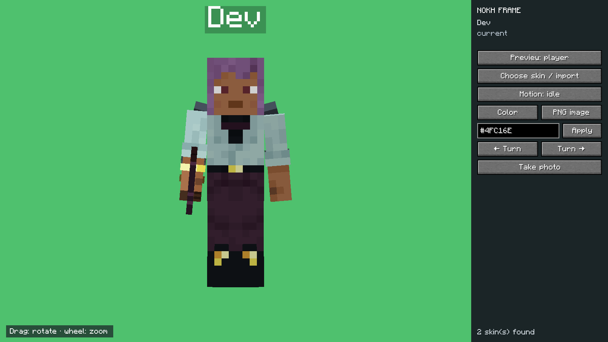

# Nokh Frame

**Français** · [English](#english)

Nokh Frame est un mod client pour Minecraft **1.21.1** et NeoForge **21.1.1 minimum** (branche 21.1.x). Il crée des aperçus photo de votre personnage avec ses cosmétiques actifs, ou de n'importe quel item enregistré par le jeu et les mods.

La version 0.5.5 est compilée avec NeoForge 21.1.1. Les tests client et les 7 GameTests ont réussi sur 21.1.1 et 21.1.252 ; les versions intermédiaires n'ont pas été testées individuellement.

[Guide complet en français](docs/USER_GUIDE.fr.md) · [Journal des versions](CHANGELOG.fr.md) · [Captures du jeu](media/screenshots/README.md)

## Utilisation

1. Installer `nokhframe-0.5.5.jar` dans le dossier `mods`, puis lancer Minecraft.
2. Entrer dans un monde et activer les cosmétiques souhaités.
3. Saisir **`/nokhframe`** dans le chat pour ouvrir le studio.
4. Choisir **Joueur** ou **Item**. Le catalogue des items permet une recherche par nom ou identifiant (`modid:item`). Saisir `@nomdumod` pour filtrer par mod, éventuellement avec un nom d'item (`@minecraft épée`). Le bouton **Depuis l'inventaire** copie l'item choisi avec ses composants.
5. Pour le joueur, sélectionner un skin dans le catalogue ou importer un PNG par glisser-déposer ou par chemin. Choisir ensuite un mouvement : repos, marche, course, accroupissement ou attaque.
6. Dans l'aperçu du joueur ou de l'item, glisser avec le bouton gauche pour tourner sur les axes horizontal et vertical. Glisser avec le bouton droit pour tourner sur le troisième axe et l'axe vertical. Utiliser la molette dans l'aperçu pour zoomer ou dézoomer.
7. Cliquer sur **Couleur** pour faire défiler les fonds prédéfinis, saisir une couleur `#RRGGBB` et cliquer sur **OK**, ou ouvrir **Image PNG** pour choisir un fond dans la bibliothèque. On peut importer le PNG par chemin ou le glisser dans cette fenêtre.
8. Cliquer sur **Prendre la photo**. Le PNG est enregistré dans le dossier `screenshots` de l'instance.

Le studio utilise le vrai personnage local, avec ses équipements et couches cosmétiques. Le pseudo au-dessus du joueur utilise le nametag natif de Minecraft. Le skin sélectionné dans le studio ne modifie pas le skin du compte visible par les autres joueurs.

La compatibilité utilise les chemins de rendu natifs de Minecraft et NeoForge : couches du joueur, modèles d'items calculés depuis la pile complète et ses composants, moteur de particules et événements de rendu du monde près du joueur. Les pets et compagnons dessinés dans ces événements ainsi que les entités vivantes proches possédées par le joueur peuvent apparaître sans dépendance envers leur mod. Un item modifié dans l'inventaire conserve ses composants lors de la sélection. Pendant les ticks client, le studio présente temporairement l'item sélectionné comme item tenu et une position de déplacement simulée aux mods qui produisent leurs effets à partir de ces données ; l'inventaire et la position réels sont conservés. La vue d'item affiche aussi les particules natives près de la main du joueur. Les rendus qui contournent ces chemins (par exemple certains shaders ou rendus propriétaires) ne sont pas garantis.

Les skins importés sont copiés dans `config/nokhframe/skins`. Seuls les PNG **64 × 64 pixels** sont acceptés. Un nom contenant `_slim` utilise les bras fins ; `_wide` utilise les bras classiques. Sans suffixe, la forme actuelle du joueur est conservée.

Les images de fond importées sont copiées dans `config/nokhframe/backgrounds`. La taille maximale est de **4096 × 4096 pixels** et **16 Mo**. L'image couvre tout le cadre de la photo ; les bords peuvent être recadrés selon ses proportions.

## Licence et communauté

Nokh Frame est publié sous [licence propriétaire, tous droits réservés](LICENSE) par NokhXyr. Les JAR officiels non modifiés peuvent être inclus et redistribués dans les modpacks et launchers, y compris publics et monétisés, aux conditions de la licence. Consultez aussi les règles de [contribution](.github/CONTRIBUTING.md), le [code de conduite](.github/CODE_OF_CONDUCT.md) et la [politique de sécurité](.github/SECURITY.md).

## Développement

Construire avec `gradlew.bat build` (Windows) ou `./gradlew build` (Linux/macOS). Le JAR se trouve dans `build/libs`.

Exécuter les GameTests NeoForge sans interface graphique avec `gradlew.bat runGameTestServer` ou `./gradlew runGameTestServer`. Aucun test JUnit n'est nécessaire. Le rendu graphique, le nametag, les cosmétiques et la capture d'image nécessitent un client Minecraft et ne sont pas couverts par le serveur GameTest.

## English

Nokh Frame is a client-side mod for Minecraft **1.21.1** and NeoForge **21.1.1 or newer** in the 21.1.x line. It makes photo previews of your character with active cosmetics, or of any item registered by Minecraft and installed mods.

Version 0.5.5 is compiled against NeoForge 21.1.1. Client checks and all 7 GameTests passed on 21.1.1 and 21.1.252; intermediate builds have not each been tested.

[Full English guide](docs/USER_GUIDE.en.md) · [Changelog](CHANGELOG.md) · [In-game screenshots](media/screenshots/README.md)

### How to use

1. Put `nokhframe-0.5.5.jar` in the `mods` folder and start Minecraft.
2. Join a world and enable the cosmetics you want to show.
3. Enter **`/nokhframe`** in chat to open the studio.
4. Choose **Player** or **Item**. Search the item catalog by display name or registry ID (`modid:item`). Type `@modname` to filter by mod, optionally followed by an item name (`@minecraft sword`). **From inventory** copies the selected stack with its data components.
5. For player previews, choose a skin from the library or import a PNG by dragging it into the window or entering its file path. Select idle, walking, running, sneaking or attacking motion.
6. In either preview, left drag to rotate horizontally and vertically. Right drag to rotate around the third axis and vertically. Scroll the mouse wheel over the preview to zoom in or out.
7. Click **Color** to cycle preset backgrounds, enter a `#RRGGBB` color and click **Apply**, or open **PNG image** to choose from the background library. Import a PNG by entering its path or dragging it into that window.
8. Click **Take photo**. The PNG is saved in the instance's `screenshots` folder.

The studio renders your actual local player, including equipment and cosmetic render layers. The name above the player uses Minecraft's native name tag. Studio skin selection does not change your account skin or the skin seen by other players.

Compatibility uses Minecraft and NeoForge's native rendering paths: player layers, item models resolved from the complete stack and its data components, the particle engine, and world rendering events near the player. Pets and companions drawn in those events, as well as nearby living entities owned by the player, can appear without a dependency on their mod. Selecting a modified item from inventory preserves its components. During client ticks, the studio temporarily presents the selected item as the held item and simulated movement to mods that emit effects from those values; the real inventory and position are preserved. The item view also renders native particles near the player's hand. Rendering that bypasses these paths (for example some shaders or proprietary renderers) is not guaranteed.

Imported skins are copied to `config/nokhframe/skins`. Only **64 × 64 PNG** files are accepted. Filenames containing `_slim` use slim arms; `_wide` uses classic arms. Other filenames keep your current player model.

Imported background images are copied to `config/nokhframe/backgrounds`. The maximum size is **4096 × 4096 pixels** and **16 MB**. The image covers the full photo frame; its edges may be cropped to fit.

### License and community

Nokh Frame is published by NokhXyr under a [proprietary, all-rights-reserved license](LICENSE). Official, unmodified JARs may be included and redistributed in modpacks and launchers, including public and monetized packs, under the license terms. See the [contribution guide](.github/CONTRIBUTING.md), [Code of Conduct](.github/CODE_OF_CONDUCT.md), and [Security Policy](.github/SECURITY.md).

### Development

Build with `gradlew.bat build` on Windows or `./gradlew build` on Linux/macOS. Find the JAR in `build/libs`.

Run the headless NeoForge GameTests with `gradlew.bat runGameTestServer` or `./gradlew runGameTestServer`. No JUnit tests are used. Rendering, name tags, cosmetics and screenshots require a Minecraft client and are outside the server GameTest scope.
