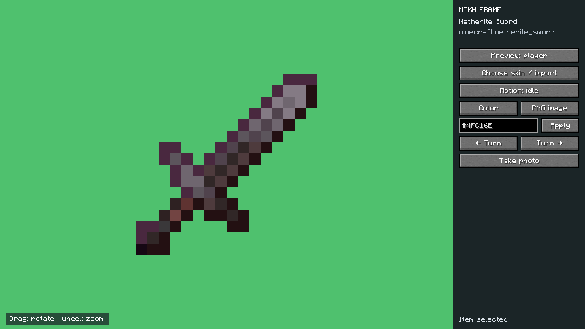
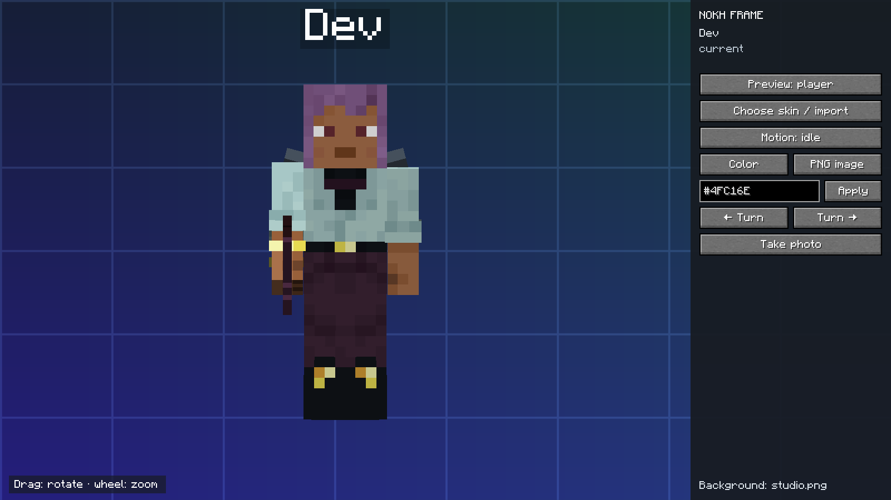

# Captures de Nokh Frame 0.5.4 / In-game screenshots

Captures PNG 1600 × 900 prises dans un monde de test Minecraft 1.21.1 avec NeoForge 21.1.250 et Nokh Frame 0.5.4. Les images du jeu sont publiées sans retouche. Le fond PNG et les skins ont été préparés pour cette démonstration. Cette instance isolée utilisait des équipements vanilla ; ces images ne démontrent pas les effets de mods cosmétiques tiers.

Unedited 1600 × 900 PNG screenshots from a dedicated Minecraft 1.21.1 test world with NeoForge 21.1.250 and Nokh Frame 0.5.4. The PNG background and skins were prepared for the demonstration. The isolated instance used vanilla equipment, so these images do not demonstrate third-party cosmetic effects.

| Fichier / File | Sujet / Subject |
| --- | --- |
| [01-player-studio.png](01-player-studio.png) | Joueur, pseudo natif et studio / Player, native name tag and studio |
| [02-skin-library.png](02-skin-library.png) | Bibliothèque de skins / Skin library |
| [03-item-studio.png](03-item-studio.png) | Aperçu d'une épée en Netherite / Netherite sword preview |
| [04-item-catalog.png](04-item-catalog.png) | Recherche `@minecraft sword` / Item search |
| [05-png-background.png](05-png-background.png) | Fond PNG importé / Imported PNG background |
| [06-background-library.png](06-background-library.png) | Bibliothèque de fonds / Background library |
| [08-clean-photo.png](08-clean-photo.png) | Photo sans les commandes du studio / Photo without studio controls |

